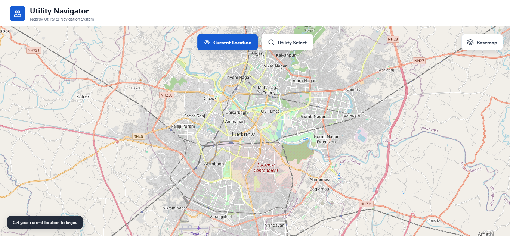
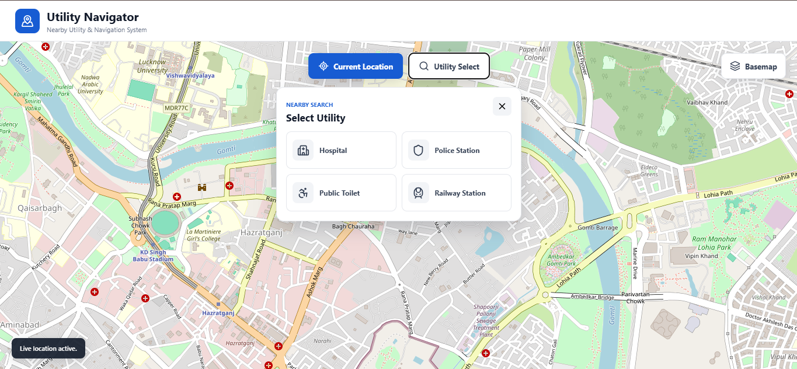
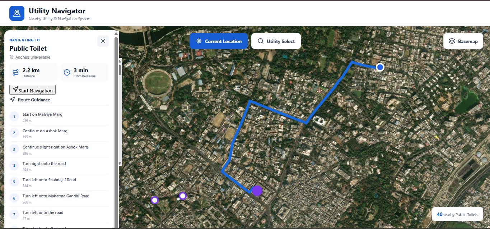

# Utility Navigator

A location-based web application for finding nearby hospitals, police stations, public toilets, and railway stations and getting driving routes to them.



## Features

* 📍 Detects the user's current location
* 🏥 Finds nearby hospitals, police stations, public toilets, and railway stations
* 🗺️ Interactive map with multiple basemap options
* 📏 Displays utilities based on distance
* 🚗 Generates driving routes to selected utilities
* 🧭 Shows route distance, estimated time, and directions

## Nearby Utilities

Select a utility type to discover nearby locations on the map.

The application currently searches within a 10 km radius using OpenStreetMap data through the Overpass API.



## Route & Navigation

Select a utility to generate a driving route from your current location.



The route panel displays:

* Destination
* Distance
* Estimated travel time
* Turn-by-turn route instructions

## How It Works

```text
Get Location
     ↓
Select Utility
     ↓
Find Nearby Locations
     ↓
Sort by Distance
     ↓
Select Destination
     ↓
Generate Driving Route
     ↓
Display Route & Directions
```

Nearby utility data is retrieved from OpenStreetMap through the Overpass API, while driving routes are generated using OSRM.

## Tech Stack

* **React** — User interface
* **Vite** — Development and build tooling
* **OpenLayers** — Interactive maps
* **OpenStreetMap + Overpass API** — Utility data
* **OSRM** — Driving routes
* **Lucide React** — Icons

## Project Structure

```text
src/
├── components/   # UI and map components
├── services/     # Utility and routing APIs
├── utils/        # Utility functions
├── App.jsx       # Main application
└── main.jsx      # Application entry point
```

## Run Locally

```bash
npm install
npm run dev
```

Open the local URL provided by Vite in your browser and allow location access when prompted.

## Notes

* Utility information depends on OpenStreetMap data coverage.
* Location access requires browser permission.
* Nearby utility search currently uses a 10 km radius.
* Routing depends on the OSRM routing service.
